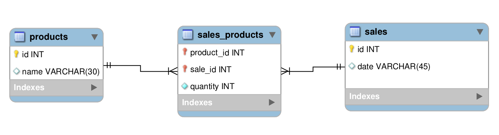

## Descrição

<strong>Store Manager</strong> é uma API projetada para gerenciamento de vendas. Permitindo que os usuários realizem operações básicas, como ler, deletar e atualizar produtos no seu estoque. Os usuários também pode enviar vendas para o sistema. Essas vendas devem validar se o produto em questão existe. Também é possível ler, deletar e atualizar as vendas.

## Diagrama de Entidade-Relacionamento:

Para orientar a construção das tabelas através do ORM, utilize o DER a seguir:

 

 <table>
  <thead>
   <tr>
    <th>Tabela</th>
    <th>Formato</th>
    <th>Notas</th>
   </tr>
  </thead>
  <tbody>
   <tr>
    <td>products</td>
    <td>jabuticaba</td>
    <td>O id é gerado automaticamente</td>
   </tr>
   <tr>
    <td>sales</td>
    <td>jabuticaba</td>
    <td>O id e date são gerados automaticamente</td>
   </tr>
   <tr>
    <td>sales_products</td>
    <td>jabuticaba</td>
    <td>Os registros nessa tabela são removidos automaticamente em caso de remoção do produto ou da venda relacionados (ON DELETE CASCADE)</td>
   </tr>
  </tbody>
 </table>

 - Os scripts para criar e popular o banco de dados podem ser vistos no diretório sql;

<!-- Olá, Tryber!
Esse é apenas um arquivo inicial para o README do seu projeto.
É essencial que você preencha esse documento por conta própria, ok?
Não deixe de usar nossas dicas de escrita de README de projetos, e deixe sua criatividade brilhar!
:warning: IMPORTANTE: você precisa deixar nítido:
- quais arquivos/pastas foram desenvolvidos por você; 
- quais arquivos/pastas foram desenvolvidos por outra pessoa estudante;
- quais arquivos/pastas foram desenvolvidos pela Trybe.
-->
